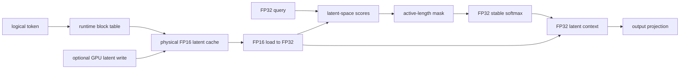

# LatentPagedAttention-rs

LatentPagedAttention-rs is a correctness-first Rust, Python, and cuTile experiment measuring the memory-compute trade-off of paged latent-cache decode attention on an RTX 4060.

## Research question

Can a paged latent cache be mutated and consumed directly on GPU without storing persistent full K/V tensors?

The repository answers this question for a controlled synthetic linear formulation. It is a GPU systems experiment, not a serving runtime or a model integration. The primary result is the measured trade-off between persistent cache bytes and decode compute.

## Result summary

The model-shaped synthetic profile compares a paged latent cache with an FP16 full-KV paged baseline:

| persistent cache | bytes |
|---|---:|
| FP16 latent cache | 65,536 |
| FP16 full-KV cache | 1,048,576 |
| persistent cache-byte ratio | 16x |

The latent read path is approximately 32.6% slower under synchronized host end-to-end timing. This is a measurable compute-for-memory trade-off, not a speedup claim. The 16x ratio counts persistent cache bytes only; it is not a claim about total GPU-memory reduction.

## Architecture

The primary path is:

```text
FP16 physical latent cache
-> runtime block-table lookup
-> optional GPU latent write
-> FP32 latent-space scores
-> masked stable softmax
-> FP32 latent-context aggregation
-> output projection
```



The cache is physically block-paged. A runtime block table maps logical token blocks to physical blocks, so validation does not rely on identity ordering. Latent rows are stored in FP16, converted to FP32 before arithmetic, and may be updated on GPU immediately before attention. The synthetic linear formulation reassociates key scores and value aggregation in latent space; it does not claim to reproduce a complete model architecture.

The baseline is FP16 full-KV paged attention. It uses the same storage width and paging controls, but stores projected K and V rows instead of latent rows. This isolates the cache representation and its associated compute path for the reported comparison.

## What is validated

- Runtime non-identity block tables and physical block addressing.
- Partial-final-block masking and runtime active sequence lengths.
- FP16 latent storage with FP32 writes, loads, scores, softmax, context, and output arithmetic.
- GPU cache write-to-attention handoff without a host cache round trip.
- Tiny correctness profile and synthetic model-shaped profile.
- FP16 full-KV paged attention baseline.
- Python oracle -> Rust CPU reference -> cuTile GPU execution parity.
- Negative controls for mapping, precision, changed elements, and inactive tokens.

Validation uses deterministic fixtures and preserves bit-exact FP16 storage checks. The validated machine is an NVIDIA GeForce RTX 4060 Laptop GPU with compute capability 8.9, 8,188 MiB VRAM, CUDA toolkit 13.3, and cuTile 0.2.0. The `model_small` profile is synthetic and model-shaped; it is not a real checkpoint.

## Reproduction

Most users need one command for repository and CPU checks:

```bash
bash scripts/validate_release.sh
```

The canonical final benchmark is exposed separately:

```bash
bash scripts/run_final_benchmark.sh
```

Maintainers can run the detailed RTX 4060 validation suite with:

```bash
bash scripts/validate_release.sh --gpu
```

The granular command catalog, environment details, and script groupings are in [Reproducibility](docs/REPRODUCIBILITY.md). The unified script does not replace those scripts; it calls the existing GPU validations so failures remain visible and isolatable.

## Final benchmark

The canonical three-process artifact is [`reports/final_benchmark/summary.csv`](reports/final_benchmark/summary.csv). Timings are synchronized host end-to-end measurements; compilation and cuTile JIT are excluded.

| operation | min ms | mean ms | max ms |
|---|---:|---:|---:|
| full-KV paged attention read | 1366.969 | 1391.022 | 1405.751 |
| latent paged attention read | 1705.150 | 1844.891 | 2017.385 |
| latent write to attention | 1367.174 | 1487.776 | 1586.213 |

The latent read mean is approximately 32.6% above the full-KV read mean. The benchmark is specific to this implementation, profile, hardware, and timing method.

## Interpretation

The cache result is the primary result: reducing persistent latent state changes
the amount of cache storage required for this fixed profile. The timing result
shows the cost observed in the current implementation when attention works in
latent space. Together they answer the research question as a controlled
memory-compute experiment. They do not establish a production serving design,
model-quality result, or general performance ranking.

## Limitations

- The algebra is a synthetic linear latent formulation, not complete DeepSeek MLA.
- No real model checkpoint, model-quality evaluation, or end-to-end generation is included.
- This is not a production PagedAttention runtime, serving system, allocator, or continuous-batching implementation.
- Dynamic allocation, eviction, prefix sharing, distributed execution, CUDA graphs, and automatic tuning are out of scope.
- No BF16, FP8, FP4, or additional precision format is evaluated.
- No claim is made about Tensor Core use or performance versus vLLM, FlashAttention, or TensorRT-LLM.
- Cache-byte ratios count persistent cache storage only, not total runtime GPU memory.
- Timing results are not general latency guarantees.

## Documentation

- [Architecture](docs/ARCHITECTURE.md): data layouts, algebra, precision flow, and GPU stages.
- [Reproducibility](docs/REPRODUCIBILITY.md): environment setup and granular commands.
- [Final report](docs/FINAL_REPORT.md): formal methodology, evidence, results, and conclusion.
- [Limitations](docs/LIMITATIONS.md): explicit boundaries and deferred work.
- [Technical article](docs/TECHNICAL_ARTICLE.md): narrative explanation for external readers.

## Release status

Latest release: `v0.1.1`

`v0.1.x` is frozen except for factual, documentation, packaging, or reproducibility fixes. Development milestone documents remain available in the repository for maintainers and readers who need implementation history.

## Citation

Use [CITATION.cff](CITATION.cff) for citation metadata.
