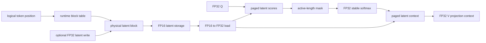

# LatentPagedAttention-rs

LatentPagedAttention-rs v0.1 is a Rust + Python research prototype for paged
latent-cache decode attention on an RTX 4060.

It demonstrates a physical paged latent cache, runtime block tables, runtime
active sequence lengths, partial-final-block masking, FP16 latent storage with
FP32 attention arithmetic, a synthetic model-shaped profile, and an FP16 full-KV
paged baseline.

It is not a production inference runtime, not full DeepSeek MLA, not a real model
checkpoint integration, and not a claim of beating vLLM, FlashAttention, or any
serving system.

## What Was Built



## Validated Hardware

- GPU: NVIDIA GeForce RTX 4060 Laptop GPU
- Compute capability: 8.9
- VRAM: 8188 MiB
- CUDA toolkit path: `/opt/cuda`
- cuTile: `0.2.0`

## Supported Profiles

| profile | q_heads | kv_heads | group | head_dim | latent_dim | block | max_seq | storage |
|---|---:|---:|---:|---:|---:|---:|---:|---|
| tiny | 4 | 2 | 2 | 8 | 8 | 2 | 8 | f32/f16 |
| model_small | 16 | 4 | 4 | 64 | 32 | 16 | 1024 | f16 |

`model_small` is synthetic and model-shaped. It is not claimed to match a
production checkpoint.

## Precision Contract

- Persistent latent cache: FP16
- Incoming latent write vector: FP32, converted to FP16 on GPU
- Q and projection weights: FP32
- Latent loads: FP16 to FP32 before arithmetic
- Scores, softmax, context accumulation, and output context: FP32
- Full-KV baseline persistent K/V cache: FP16 with FP32 arithmetic

## Final Benchmark Summary

The committed final benchmark uses synchronized host end-to-end timing. It is
not kernel-only latency.

| operation | process_count | min_ms | mean_ms | max_ms |
|---|---:|---:|---:|---:|
| full_kv_paged_attention_read | 3 | 1366.969 | 1391.022 | 1405.751 |
| latent_paged_attention_read | 3 | 1705.150 | 1844.891 | 2017.385 |
| latent_write_to_attention | 3 | 1367.174 | 1487.776 | 1586.213 |

The README table reflects the final committed three-process benchmark in
`reports/final_benchmark/summary.csv`. Based on the committed mean values, the
latent read path is approximately `32.6%` slower than the FP16 full-KV paged
baseline under synchronized host end-to-end timing.

## Cache-Byte Comparison

For `model_small`:

- FP16 latent cache bytes: `65,536`
- FP16 full-KV cache bytes: `1,048,576`
- Persistent cache-byte ratio, full-KV to latent: `16x`

This ratio counts persistent cache bytes only. It is not a total GPU-memory
reduction claim.

## Reproduce

```bash
UV_PROJECT_ENVIRONMENT=attention99 uv sync
UV_PROJECT_ENVIRONMENT=attention99 uv run pytest -q
UV_PROJECT_ENVIRONMENT=attention99 uv run ruff check .
cargo fmt --all --check
cargo test --workspace
cargo clippy --workspace --all-targets -- -D warnings
```

GPU validation:

```bash
source scripts/cutile_env.sh
cargo check -p plkv-kernels --features gpu-cutile --examples
bash scripts/run_cutile_smoke.sh
bash scripts/run_gpu_paged_lookup.sh
bash scripts/run_gpu_paged_kv_write.sh
bash scripts/run_gpu_gqa_decode.sh
bash scripts/run_gpu_paged_gqa_decode.sh
bash scripts/run_gpu_latent_kv_reconstruction.sh
bash scripts/run_gpu_direct_latent_gqa.sh
bash scripts/run_gpu_direct_paged_latent_gqa.sh
bash scripts/run_gpu_paged_latent_write_attention.sh
bash scripts/run_gpu_fp16_paged_latent_attention.sh
bash scripts/run_gpu_runtime_sequence_validation.sh
bash scripts/run_gpu_model_profile_validation.sh
bash scripts/run_gpu_fp16_full_kv_baseline.sh
bash scripts/run_final_benchmark.sh
```

## Repository Layout

```text
python_ref/      NumPy references and fixture generation
tests/           Python reference and fixture tests
crates/plkv-core Rust CPU references
crates/plkv-kernels cuTile kernels and GPU validation examples
scripts/         Reproduction and validation scripts
docs/            Architecture, reproducibility, limitations, final report
fixtures/        Deterministic tiny-profile JSON fixtures
reports/         Small committed benchmark summary artifacts
```

## Documentation

- [Architecture](docs/ARCHITECTURE.md)
- [Reproducibility](docs/REPRODUCIBILITY.md)
- [Final report](docs/FINAL_REPORT.md)
- [Limitations](docs/LIMITATIONS.md)
- [Release checklist](docs/RELEASE_CHECKLIST.md)

## Release Status

v0.1.0 completion status:

1. Python reference correctness - done
2. Rust parity and golden fixtures - done
3. RTX 4060 cuTile execution - done
4. Direct paged latent-space GQA - done
5. Paged latent write-to-attention round trip - done
6. FP16 latent storage with FP32 accumulation - done
7. Runtime active sequence length and partial blocks - done
8. Synthetic model-shaped profile - done
9. FP16 full-KV paged baseline - done
10. Final synchronized host benchmark - done

Deferred to v0.2 or later: BF16, FP8/FP4, real checkpoints, dynamic allocation,
prefix sharing, eviction, continuous batching, production scheduling, CUDA graphs,
distributed inference, automatic tuning, and full DeepSeek MLA reproduction.

## Citation

Use [CITATION.cff](CITATION.cff) for citation metadata.
