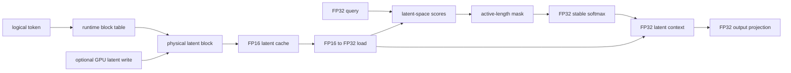

# LatentPagedAttention-rs

LatentPagedAttention-rs is a correctness-first Rust, Python, and cuTile experiment measuring the memory-compute trade-off of paged latent-cache decode attention on an RTX 4060.

## Research question

Can a paged latent cache be mutated and consumed directly on GPU without storing persistent full K/V tensors?

This repository answers that question for a controlled synthetic linear formulation. The primary path stores physical FP16 latent blocks, resolves runtime block tables, optionally writes a latent row on GPU, computes attention in latent space with FP32 arithmetic, and never persists reconstructed K/V tensors.

## Result summary

The synthetic `model_small` profile uses 16 query heads, 4 KV heads, head dimension 64, latent dimension 32, block size 16, and a maximum sequence length of 1,024.

| persistent cache | bytes |
|---|---:|
| FP16 latent cache | 65,536 |
| FP16 full-KV cache | 1,048,576 |
| full-KV to latent cache-byte ratio | 16x |

The latent read path is approximately 32.6% slower than the FP16 full-KV read baseline under synchronized host end-to-end timing. This is a measured compute-for-memory trade-off, not a speedup claim and not a total GPU-memory reduction claim.

## Architecture



## What is validated

- Runtime non-identity block tables and physical block addressing.
- Runtime active sequence lengths and partial-final-block masking.
- FP16 latent storage with FP32 writes, loads, scores, softmax, and context arithmetic.
- GPU latent-cache write-to-attention handoff without a host cache round trip.
- Tiny exhaustive correctness profile and synthetic model-shaped profile.
- FP16 full-KV paged attention baseline using the same persistent storage width.
- Python oracle, Rust CPU reference, cuTile GPU execution, parity checks, and negative controls.

The validated hardware is an NVIDIA GeForce RTX 4060 Laptop GPU with compute capability 8.9, 8,188 MiB VRAM, CUDA toolkit 13.3, and cuTile 0.2.0. `model_small` is synthetic and model-shaped; it is not a production checkpoint or model integration.

## Reproduce

For the public CPU and repository checks:

```bash
bash scripts/validate_release.sh
```

For the committed benchmark:

```bash
bash scripts/run_final_benchmark.sh
```

Maintainers can run the full manual RTX 4060 validation suite with:

```bash
bash scripts/validate_release.sh --gpu
```

The exact environment setup and individual regression commands are documented in [Reproducibility](docs/REPRODUCIBILITY.md).

## Final benchmark

The canonical three-process summary is committed in [`reports/final_benchmark/summary.csv`](reports/final_benchmark/summary.csv). Timing is synchronized host end-to-end timing, not kernel-only latency; compilation and cuTile JIT are excluded.

| operation | min ms | mean ms | max ms |
|---|---:|---:|---:|
| full-KV paged attention read | 1366.969 | 1391.022 | 1405.751 |
| latent paged attention read | 1705.150 | 1844.891 | 2017.385 |
| latent write to attention | 1367.174 | 1487.776 | 1586.213 |

## Limitations

- The algebra is a synthetic linear latent formulation, not complete DeepSeek MLA.
- No real model checkpoint or model-quality evaluation is included.
- This is not a production PagedAttention runtime, serving system, allocator, or continuous-batching implementation.
- Dynamic allocation, eviction, prefix sharing, distributed inference, CUDA graphs, and automatic tuning are out of scope.
- No claim is made about Tensor Core use or performance versus vLLM, FlashAttention, or TensorRT-LLM.
- Cache-byte ratios count persistent cache storage only, not total runtime GPU memory.
- Timing results describe this implementation and measurement method; they are not general latency guarantees.

## Documentation

- [Architecture](docs/ARCHITECTURE.md): data layouts, algebra, precision, and GPU stages.
- [Reproducibility](docs/REPRODUCIBILITY.md): environment setup and granular commands.
- [Final report](docs/FINAL_REPORT.md): formal methodology, evidence, and results.
- [Limitations](docs/LIMITATIONS.md): explicit boundaries and deferred work.
- [Technical article](docs/TECHNICAL_ARTICLE.md): narrative explanation for external readers.

Source layout: Python references and tests live in `python_ref/` and `tests/`; Rust CPU references live in `crates/plkv-core`; cuTile kernels and GPU examples live in `crates/plkv-kernels`; deterministic fixtures are in `fixtures/`; committed benchmark summaries are in `reports/`.

## Release status

Latest release: `v0.1.1`.

The `v0.1.x` line is frozen except for factual, documentation, packaging, or reproducibility fixes. Development milestone details remain available in [Development history](docs/DEVELOPMENT_HISTORY.md).

## Citation

Use [CITATION.cff](CITATION.cff) for citation metadata.
