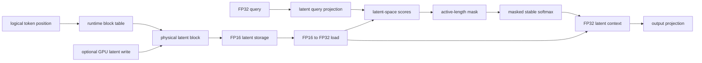

# Architecture

This document is the detailed implementation reference for the frozen
`v0.1.x` experiment. The public hierarchy is: paged latent-cache attention,
the FP16 full-KV baseline, and the Python/Rust/GPU validation chain.

## Primary data path

The direct path is:

```text
FP16 physical latent cache
-> runtime block-table lookup
-> optional GPU latent write
-> FP32 latent-space scores
-> masked stable softmax
-> FP32 latent-context aggregation
-> output projection
```



The cache stores physical blocks. Logical token positions are translated using
the runtime block table and the within-block offset. The tiny fixture uses the
non-identity mapping `[2, 0, 3, 1]`; the model-shaped profile uses a deterministic
64-block permutation. These controls catch implementations that accidentally
assume logical and physical block order are equal.

## Synthetic linear formulation

The experiment uses latent rows `L_t` and fixed FP32 projection weights:

```text
K_t = L_t W_k
V_t = L_t W_v
```

Key scores can be reassociated without materializing persistent K rows:

```text
q K_t^T = q (L_t W_k)^T = L_t (W_k q)
```

The query is projected into latent space, then dotted with the paged latent
row. Value aggregation is likewise reassociated:

```text
sum_t p_t V_t = sum_t p_t (L_t W_v) = (sum_t p_t L_t) W_v
```

The attention path therefore accumulates a latent context and applies the value
projection afterward. This is a controlled synthetic linear formulation, not a
complete model architecture or real-checkpoint implementation.

## Precision flow

- Persistent latent cache rows are FP16.
- Incoming latent writes are FP32 and converted to FP16 on GPU.
- Latent loads are converted from FP16 to FP32 before arithmetic.
- Queries, projection weights, scores, softmax, latent context, and output projection use FP32 arithmetic.
- The full-KV baseline stores projected K and V in FP16 and uses FP32 arithmetic for attention.

The validation suite includes bit-exact FP16 storage checks, unchanged-region
checks, and parity against CPU references. Tolerance values and fixtures are
defined by the existing validation code and are not changed by documentation
work.

## Runtime stages

1. Resolve each logical token through the runtime block table.
2. Optionally write one new latent row to its physical FP16 cache location.
3. Load active latent rows and convert them to FP32.
4. Compute latent-space scores from the FP32 projected query.
5. Mask inactive positions, including unused slots in a partial final block.
6. Apply stable FP32 softmax and aggregate the active latent rows.
7. Apply the output projection to the latent context.

The write-to-attention validation checks that the updated device cache is
consumed by the following attention execution without a host cache round trip.

## Baseline

The FP16 full-KV paged baseline uses the same synthetic source, block-table
addressing, active-length masking, and persistent storage width. It stores
projected K and V rows rather than latent rows, then performs FP32 attention.
This gives the benchmark a concrete storage and compute reference without
introducing a serving-system comparison.

## Profiles and evidence

The tiny profile is used for exhaustive correctness and negative controls. The
`model_small` profile has 16 query heads, 4 KV heads, head dimension 64, latent
dimension 32, block size 16, and maximum sequence length 1,024. It exercises
partial blocks, non-identity mappings, and the reported cache-byte accounting.

The evidence chain is:

```text
Python oracle -> Rust CPU reference -> cuTile GPU execution -> readback/parity
```

Checks include finite outputs, probability row sums, zero inactive
probabilities, changed-element controls, bit-exact FP16 storage, and matching
scores/context. Detailed commands are grouped in
[REPRODUCIBILITY.md](REPRODUCIBILITY.md); historical implementation notes are
indexed by [DEVELOPMENT_HISTORY.md](DEVELOPMENT_HISTORY.md).
