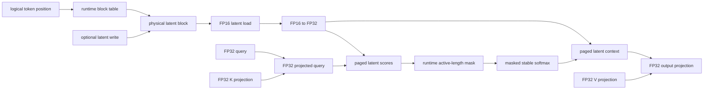

# Architecture

The direct latent path stores physical latent-cache blocks and resolves logical
tokens through a runtime block table. It does not persist a logical latent cache
or reconstructed K/V tensors on the GPU.
