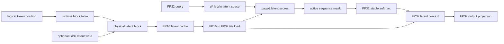

# Building Paged Latent-Cache Attention on an RTX 4060: A 16x Cache Reduction with a Measured Compute Trade-Off

## 1. The Inference-Memory Problem

Autoregressive inference has a simple but expensive habit: every generated token
depends on the tokens that came before it. Transformer decoders avoid recomputing
all previous keys and values by storing a K/V cache. At decode time, the model
computes the new query and attends over the cached K/V state for the prefix.

That cache grows with sequence length, number of layers, number of KV heads, and
head dimension. In practical serving systems, it is often one of the central
memory constraints. Paging helps with allocation and fragmentation, but it does
not by itself change the number of values stored per token. Latent-cache designs
ask a different question: can we store a smaller per-token representation and
recover the attention computation from that representation?

LatentPagedAttention-rs is a correctness-first prototype built around that
question. It is intentionally small, synthetic, and explicit. The goal is not to
ship a serving runtime. The goal is to validate the addressing, mutation,
precision, masking, and correctness chain for a paged latent-cache attention path
on commodity GPU hardware.

## 2. Research Question

Can a paged latent cache be addressed, mutated, and consumed directly on a
commodity RTX 4060 without reconstructing persistent full K/V buffers?

The project answers this for a fixed synthetic linear setup using Python
references, Rust CPU references, deterministic fixtures, and cuTile GPU kernels.
The final release validates both a tiny debugging profile and a synthetic
model-shaped profile.

## 3. Architecture

The direct latent path stores physical latent-cache blocks. A runtime block table
maps logical token positions to those physical blocks. The attention path reads
the physical latent blocks directly, converts FP16 storage to FP32, computes
latent-space scores, applies a masked stable softmax, aggregates a latent
context, and applies an FP32 output projection.



The final GPU flow for write-to-attention is:

```text
initial FP16 physical latent cache
-> FP32 latent write converted to FP16 on GPU
-> updated cache remains on GPU
-> direct paged latent scores
-> masked stable softmax
-> direct paged latent context
-> FP32 context
```

## 4. Direct Latent-Space Algebra

The algebra is based on reassociation in a synthetic linear setup.

For keys:

```text
K_t = L_t W_k
```

The usual score term can be reassociated:

```text
q K_t^T
= q (L_t W_k)^T
= L_t (W_k q)
```

Instead of materializing full K rows, the kernel projects the query into latent
space and dots it with latent cache rows.

For values:

```text
V_t = L_t W_v
```

The context term can also be reassociated:

```text
sum_t p_t V_t
= sum_t p_t (L_t W_v)
= (sum_t p_t L_t) W_v
```

The GPU path therefore aggregates a latent context first, then applies the V
projection. This is not complete DeepSeek MLA. It is not a real-checkpoint
integration. It is a controlled linear testbed for the cache and attention
mechanics.

## 5. Paging and Writes

The project uses non-identity block tables throughout validation. The tiny
profile uses:

```text
[2, 0, 3, 1]
```

This catches kernels that accidentally assume logical and physical block order
are identical. The model-shaped profile uses a deterministic 64-block
permutation and records a checksum.

Writes mutate one existing logical token position inside an already allocated
physical cache. The write kernel owns one physical block tile, resolves the
runtime token position through the block table, and replaces exactly one row.
Both offset-zero and offset-one cases are validated. The updated cache is then
used directly by the attention kernels without reading it to host and uploading
it again.

Runtime active sequence length is also validated. Inactive token positions are
masked out of softmax and do not contribute to context. Partial-final-block cases
are covered in the tiny profile and the model-shaped profile.

## 6. Precision Design

The precision contract is deliberately narrow:

```text
persistent latent cache: FP16
incoming write vector: FP32
GPU write conversion: FP32 -> FP16
cache loads: FP16 -> FP32
Q and projection weights: FP32
scores: FP32
stable softmax: FP32
context accumulation: FP32
output context: FP32
```

The project also implements an FP16 full-KV paged baseline with FP32 arithmetic.
That makes the cache-byte comparison fair in storage width: latent cache and
full-KV cache both use FP16 persistent storage.

## 7. Correctness Methodology

The validation chain is:

```text
Python oracle
-> deterministic fixture
-> Rust CPU reference
-> cuTile GPU execution
-> readback and parity
```

The tests check finite outputs, probability row sums, inactive probabilities,
non-identity block-table effects, changed-element counts after writes, unchanged
regions after writes, and bit-exact FP16 cache storage. Negative controls include
identity block tables and projection changes. Earlier in the project, a scaffold
GPU example that printed success markers without real execution was replaced
with a real validation harness; that became a useful reminder that release
markers are not evidence unless kernels execute and outputs are compared.

## 8. Model-Shaped Profile

The validated `model_small` profile is:

```text
q_heads = 16
kv_heads = 4
group_size = 4
head_dim = 64
latent_dim = 32
block_size = 16
max_seq_len = 1024
storage = FP16
attention arithmetic = FP32
```

This profile is synthetic. It is shaped like an inference kernel problem, but it
does not claim to match a production model architecture or checkpoint.

## 9. Results

The committed benchmark uses synchronized host end-to-end timing over three
measured processes. Compilation and cuTile JIT are excluded. The numbers are not
kernel-only latency.

| operation | process_count | min_ms | mean_ms | max_ms |
|---|---:|---:|---:|---:|
| full_kv_paged_attention_read | 3 | 1366.969 | 1391.022 | 1405.751 |
| latent_paged_attention_read | 3 | 1705.150 | 1844.891 | 2017.385 |
| latent_write_to_attention | 3 | 1367.174 | 1487.776 | 1586.213 |

For the `model_small` profile:

```text
FP16 latent cache bytes = 65,536
FP16 full-KV cache bytes = 1,048,576
persistent cache-byte ratio = 16x
```

The latent cache is 16x smaller in persistent bytes, while the current latent
read path is approximately 32.6% slower than the FP16 full-KV read baseline by
mean synchronized host end-to-end time. This is a compute-for-memory trade-off.

## 10. Why the Latent Path Is Currently Slower

The project does not include a kernel profiler breakdown, so the following are
hypotheses and future profiling targets rather than measured conclusions.

The latent path performs extra projection arithmetic. The kernels are fixed
profile research kernels, not mature tuned kernels. Timing is synchronized
host end-to-end rather than isolated kernel timing. The current path does not
claim fusion, Tensor Core use, CUDA graphs, or automatic kernel tuning. All of
those can affect latency and should be measured before making performance claims.

## 11. What This Project Proves

It proves that, for this synthetic setup, a paged FP16 latent cache can be
addressed through runtime block tables, mutated on GPU, consumed directly by
latent-space GQA kernels, masked for runtime active sequence lengths, and
validated against Python and Rust references on an RTX 4060.

It also proves a persistent cache-byte reduction for the synthetic `model_small`
profile relative to an FP16 full-KV baseline, with a measured latency cost in the
current implementation.

## 12. What It Does Not Prove

It does not prove production readiness. It does not beat vLLM, FlashAttention,
or TensorRT-LLM. It is not complete DeepSeek MLA. It is not a real-model
checkpoint integration. It does not prove Tensor Core usage. It does not prove
total GPU-memory reduction. It does not prove model-quality preservation. It is
not a production PagedAttention runtime, continuous-batching system, or dynamic
cache allocator.

## 13. What I Learned

The strongest lesson was to verify real GPU execution instead of trusting printed
markers. Another important detail was tile-coordinate semantics: loading a
physical cache block by tile coordinate is different from using an element-row
offset. I also had to keep storage precision separate from arithmetic precision;
FP16 cache storage does not imply FP16 softmax or FP16 accumulation. Finally, the
benchmark forced an honest separation between persistent cache bytes and total
process memory.

## 14. Reproduction

```bash
UV_PROJECT_ENVIRONMENT=attention99 uv sync
UV_PROJECT_ENVIRONMENT=attention99 uv run pytest -q
UV_PROJECT_ENVIRONMENT=attention99 uv run ruff check .
cargo fmt --all --check
cargo test --workspace
cargo clippy --workspace --all-targets -- -D warnings
source scripts/cutile_env.sh
bash scripts/run_gpu_runtime_sequence_validation.sh
bash scripts/run_gpu_model_profile_validation.sh
bash scripts/run_gpu_fp16_full_kv_baseline.sh
bash scripts/run_final_benchmark.sh
```

## 15. Conclusion

LatentPagedAttention-rs v0.1.1 is a completed correctness-first research prototype.
It exposes a concrete memory-versus-compute trade-off: 16x fewer persistent cache
bytes for the synthetic model-shaped profile, with approximately 32.6% higher
measured latent-read time in the current implementation. That is a useful
foundation for future kernel optimization, not a product launch.
